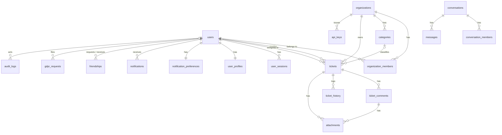

*This project has been created as part of the 42 curriculum by fcela-ga, <login2>, <login3>, <login4>.*

<!-- DRAFT prepared by DevOps (fcela-ga). Every block marked TODO(<role>) must be
     filled in by the person named before the defense; the infrastructure,
     instructions and operations sections describe the code as it is. -->

# HelpDesk Lite

**Live:** https://helpdesklite.me · **Staging:** https://staging.helpdesklite.me
(protected by a Cloudflare challenge; ask the team for access)

## Description

HelpDesk Lite is a multi-tenant help-desk (ticketing) web application. An
organization registers, invites its members and agents, and its users open
tickets that agents triage, assign, discuss and resolve, with the whole
history kept for audit. It is built as a monorepo (React front end, Express
API, shared validation contracts) and runs in production on a single
ARM server behind Cloudflare, with encrypted off-site backups and a full
monitoring and alerting stack.

Key features:

- Accounts with e-mail verification, password reset, sessions with rotating
  refresh tokens and reuse detection, progressive lockout after failed logins.
- Organizations with three roles (`MEMBER`, `AGENT`, `ORG_ADMIN`) plus a
  platform `GLOBAL_ADMIN`; per-organization categories and API keys.
- Tickets with priority, category, status workflow
  (`OPEN → IN_PROGRESS → RESOLVED → CLOSED`), assignment to agents, public
  and internal comments, attachments (type-checked, image-normalized) and an
  append-only history.
- Real-time updates and direct messages over Socket.IO; friendships; in-app
  and e-mail notifications with per-user preferences.
- Public REST API for integrations, authenticated with scoped API keys and
  rate-limited per key.
- GDPR: data export and account deletion requests; audit log of sensitive
  actions; legal pages (privacy policy, terms of service).
- User locale (English / Spanish), timezone and theme stored per account.
- Operations: CI with tests and security scans, staging and production
  pipelines with approval gate and automatic rollback, encrypted backups
  with weekly restore drills, Prometheus/Grafana/Loki observability and
  Telegram + e-mail alerting.

## Instructions

### Prerequisites

| Tool | Version | Notes |
|---|---|---|
| Node.js | 24 (`.nvmrc`) | npm ≥ 11 |
| Docker | ≥ 27 with Compose v2 | PostgreSQL 15, Redis 7 and Mailpit run in containers |
| GNU Make | any | convenience targets (`make up-dev`, `make down-dev`, …) |

### Run it locally (development)

```bash
git clone <repo-url> && cd <repo>
cp .env.example .env            # defaults work for local development
make up-dev                     # generates dev secrets, builds and starts db, redis, mailpit, api and web
npm install                     # workspaces: apps/api, apps/web, packages/contracts, packages/ui
npm run dev:api                 # http://localhost:5000  (API, hot reload)
npm run dev:web                 # http://localhost:5173  (Vite)
```

- Mailpit (captured e-mails): http://localhost:8025
- API reference: [`apps/api/ENDPOINTS.md`](apps/api/ENDPOINTS.md) (105 routes)
- Front/back integration notes: [`apps/web/INTEGRATION.md`](apps/web/INTEGRATION.md)
- Quality gates, same as CI: `npm run lint`, `npm run typecheck`,
  `npm run format:check`, `npm test --workspaces --if-present`.

`.env` variables (names only; see `.env.example` for defaults): database
(`DATABASE_URL`, `POSTGRES_*`), `REDIS_URL`, `JWT_ACCESS_SECRET`,
`JWT_REFRESH_SECRET`, `PASSWORD_PEPPER`, token TTLs, `SMTP_*`/`MAIL_FROM`,
upload limits, rate limits, `CORS_ORIGINS`, `METRICS_TOKEN` (optional),
`BOOTSTRAP_ADMIN_EMAIL` (optional: the account with that e-mail becomes
`GLOBAL_ADMIN` on first start).

### Production

Production is not started by hand: merging into `develop` deploys staging,
merging into `main` (pull request approved by another person; the `gate`
job checks it) deploys production. The pipeline builds ARM64 images, pushes
them to GHCR tagged with the commit SHA, takes a pre-deploy backup, runs the
Prisma migrations, starts the stack and rolls back automatically if the API
does not become healthy. Everything an operator needs — diagnosis, manual
redeploy, restore, planned stops, alerts, the fallback plan when Cloudflare
is blocked — is in the team's DevOps guide and runbook, kept outside this
repository (ask the DevOps member).

```
Browser ─HTTPS─▶ Cloudflare (WAF, cache, TLS) ─▶ Oracle Cloud VM (ARM, Ubuntu)
                                                   ├─ Nginx Proxy Manager (:80/:443, only from Cloudflare ranges)
                                                   ├─ prod:    web (nginx) · api (Express) · db (PostgreSQL 15) · redis · mailpit · backup (cron)
                                                   ├─ staging: same stack, separate volumes and secrets
                                                   └─ observability: Prometheus · Alertmanager · Grafana · Loki/Promtail · exporters
Backups ─encrypted─▶ Oracle Object Storage        Alerts ─▶ Telegram + e-mail
```

## Resources

- Express 5 — https://expressjs.com/ · Prisma — https://www.prisma.io/docs ·
  Zod — https://zod.dev · Socket.IO — https://socket.io/docs/v4/
- React 19 — https://react.dev · Vite — https://vite.dev
- PostgreSQL 15 — https://www.postgresql.org/docs/15/ · Redis — https://redis.io/docs/
- OWASP ASVS and Cheat Sheet Series (authentication, session management,
  file upload) — https://cheatsheetseries.owasp.org/
- Prometheus — https://prometheus.io/docs/ · Grafana — https://grafana.com/docs/ ·
  Loki — https://grafana.com/docs/loki/
- Docker Compose — https://docs.docker.com/compose/ · GitHub Actions — https://docs.github.com/actions
- Cloudflare (proxy, WAF, SSL modes) — https://developers.cloudflare.com/

### How AI was used

<!-- TODO(each member): add your own usage honestly; the subject requires it. -->

- **DevOps (fcela-ga):** Claude Code (Anthropic) was used as a pair for the
  infrastructure work: reviewing the two external audits against the real
  code and server, diagnosing alerts and incidents from logs and metrics,
  drafting the operations scripts (`scripts/ops/*`, `scripts/backup.sh`,
  `scripts/restore.sh`), the alert rules, the production gate and this
  runbook, and analysing the automated review comments on pull requests.
  Every script was executed and verified on the server by the author; the
  decisions (what to fix, what to leave out of scope, what to ask the team)
  were taken by the author and are recorded in the audit reports.
- **Backend:** TODO(backend).
- **Frontend:** TODO(frontend).

## Team Information

<!-- TODO(PM): confirm logins, roles and responsibilities. -->

| Member | Role(s) | Responsibilities |
|---|---|---|
| fcela-ga | DevOps / infrastructure | CI/CD, hosting, security hardening, backups and recovery, observability and alerting, operations documentation |
| <login2> | TODO | TODO |
| <login3> | TODO | TODO |
| <login4> | TODO | TODO |

## Project Management

<!-- TODO(PM): meetings cadence, task board, how tasks were split. -->

- Code: GitHub, feature branches (`backend`, `frontend`, `dev-ops`) merged
  into `develop` through pull requests reviewed by another member; `main`
  only receives `develop` and is what production runs. Pull request
  template with a merge checklist; CODEOWNERS for the infrastructure paths.
- Documentation: Notion workspace (endpoints, integration guides) and the
  Markdown files in this repository.
- Communication: TODO(PM) (e.g. Discord/WhatsApp, weekly sync).
- Task tracking: TODO(PM) (e.g. Trello/GitHub Projects).

## Technical Stack

| Layer | Choice | Why |
|---|---|---|
| Front end | React 19, TypeScript, Vite 8, hand-rolled router (`app/routes.ts`), feature folders (`features/*`), shared `packages/ui` | No framework beyond React: small bundle, full control of routing and state; typed end to end with the shared contracts |
| API | Node 24, Express 5, TypeScript, Zod 4 (`packages/contracts`) | Small, explicit HTTP layer; every payload validated by the same schemas the front end uses |
| Data access | Prisma 7 with `@prisma/adapter-pg`, versioned migrations | Typed queries, migrations applied automatically on deploy |
| Database | PostgreSQL 15 | Relational data (organizations → members → tickets → comments) with strong constraints and cascades; mature backup tooling (`pg_dump`/`pg_restore`) |
| Cache / sessions | Redis 7 (`ioredis`) | Access-token revocation, refresh-token families, rate limiting, Socket.IO state |
| Real time | Socket.IO 4 | Tickets, chat and notifications pushed to the browser; handshake authenticated with the access token |
| Auth | Argon2id + pepper, JWT access (15 min) + HttpOnly rotating refresh cookie | Short-lived tokens, reuse detection, logout everywhere |
| Files | multer + file-type + sharp | Uploads verified by content, images re-encoded |
| Mail | nodemailer → Mailpit (captured) | No real e-mail leaves the demo environments |
| Web server | nginx (front end) + Nginx Proxy Manager | Static assets with cache and security headers; one entry point per environment |
| Infrastructure | Docker Compose, Oracle Cloud (ARM Ampere), Cloudflare | Free ARM instance; Cloudflare hides the origin and terminates TLS for visitors |
| CI/CD | GitHub Actions, GHCR, Trivy, gitleaks, Dependabot | Tests + scans on every PR; images built once and promoted by SHA |
| Observability | Prometheus, Alertmanager, Grafana, Loki + Promtail, node/cAdvisor/postgres/redis/blackbox exporters | 21 alert rules with runbooks; logs searchable without SSH |
| Backups | `backup.sh` (AES-256, `pg_dump` + uploads) → Oracle Object Storage; `restore.sh --drill` weekly | Measured RTO (seconds), verified integrity, tested restores |

## Database Schema

PostgreSQL schema managed by Prisma (`apps/api/prisma/schema.prisma`, 20
tables). Main entities and relationships:



Key fields:

- `users`: `id` (UUID v7), `email` (unique), `username` (unique), `passwordHash`
  (Argon2id), `globalRole` (`USER` | `GLOBAL_ADMIN`), `isActive`,
  `failedLoginCount`, `locale`, `timezone`, `theme`.
- `organizations`: `id`, `name`, `slug` (unique), `ticketSeq` (per-org ticket
  numbering), `createdById`.
- `organization_members`: (`organizationId`, `userId`) unique, `role`
  (`MEMBER` | `AGENT` | `ORG_ADMIN`), `invitedById`.
- `tickets`: `id`, `reference` (e.g. `VILANO-0001`: six letters of the org slug + sequence), `title`, `description`,
  `status` (`OPEN` | `IN_PROGRESS` | `RESOLVED` | `CLOSED`), `priority`
  (`LOW` | `MEDIUM` | `HIGH`), `categoryId`, `createdById`, `assignedToId`,
  `resolvedAt`, `closedAt`.
- `ticket_comments`: `body`, `isInternal` (agents only), soft delete;
  `ticket_history`: `field`, `oldValue`, `newValue`, `note` (append-only).
- `attachments`: `originalName`, `storageKey`, `mimeType`, `sizeBytes`,
  `status`, linked to a ticket or a comment.
- `user_sessions`: `familyId`, `refreshTokenHash`, `replacedById`
  (rotation chain, reuse detection), `userAgent`, `ip`.
- `api_keys`: `prefix`, `keyHash`, `scopes`, `rateLimitPerMinute`,
  `lastUsedAt`; `audit_logs`: `actorId` / `apiKeyId`, `action`, `entity`,
  `entityId`, `before`/`after`, `ip`.

Deleting a user or an organization cascades to its dependent rows
(sessions, memberships, categories, tickets, comments, attachments);
assignee and category references are set to `NULL`.

## Features List

<!-- TODO(each member): one line per feature you built; keep it honest. -->

| Feature | Who | Description |
|---|---|---|
| Authentication & sessions | TODO(backend) | Register, e-mail verification, login with lockout, refresh rotation, logout everywhere |
| Organizations, roles, categories, API keys | TODO(backend) | Multi-tenant model with RBAC policies |
| Tickets, comments, attachments, history | TODO(backend) | Workflow, assignment, internal notes, upload validation |
| Real-time & chat | TODO(backend) | Socket.IO rooms per ticket/user, direct messages, presence |
| Notifications & e-mail | TODO(backend) | In-app + SMTP, user preferences |
| Public API | TODO(backend) | Scoped API keys, per-key rate limits |
| GDPR export/delete, audit log | TODO(backend) | |
| Front end (all screens) | TODO(frontend) | Sign in / register, workspace, organizations, ticket list / detail / create, people and profiles, messages, account and privacy, global admin, legal pages |
| CI/CD pipelines | fcela-ga | Reusable CI (lint, types, tests, Trivy, gitleaks), staging/production deploys with approval gate and rollback |
| Hosting & security hardening | fcela-ga | Oracle VM, Cloudflare, origin closed to Cloudflare ranges (VCN + iptables), fail2ban, least-privilege DB roles, security headers, rate limits |
| Backups & recovery | fcela-ga | Encrypted daily backups off-site, weekly restore drills with measured RTO, production restore with integrity checks |
| Observability & alerting | fcela-ga | Prometheus/Grafana/Loki, 21 alert rules, Telegram + e-mail, self-healing timer |
| Operations documentation | fcela-ga | DevOps guide, runbook, audit reports and secrets inventory (kept outside the repository) |

## Modules

<!-- TODO(PM): list the chosen Major/Minor modules with points, justification,
     implementation notes and owner. Suggested infrastructure-related entries: -->

| Module | Type | Points | Owner | Implementation |
|---|---|---|---|---|
| TODO | Major | 2 | TODO | TODO |
| Monitoring system (Prometheus / Grafana) | Minor | 1 | fcela-ga | `compose.observability.yml`: Prometheus 3, Grafana 11, Alertmanager, exporters, 21 alert rules with runbooks |
| Infrastructure setup for log management (Loki / Promtail) | Minor | 1 | fcela-ga | Centralized container logs with secret masking, searchable in Grafana |
| TODO | … | … | … | … |
| **Total** | | **TODO** | | |

## Individual Contributions

<!-- TODO(each member): what you built, challenges and how you solved them. -->

### fcela-ga — DevOps

- Designed and ran the delivery pipeline: reusable CI, SHA-tagged ARM64
  images on GHCR, staging on `develop`, production on `main` behind an
  approval gate (`scripts/ci/prod-gate.mjs`), pre-deploy backup and
  automatic rollback (`scripts/deploy/remote-deploy.sh`).
- Hosted the platform on Oracle Cloud behind Cloudflare; closed the origin
  to Cloudflare's ranges at two layers (VCN security list and
  `DOCKER-USER`), hardened SSH, added fail2ban, least-privilege database
  roles, nginx security headers and rate limits.
- Built the backup system (encrypted, verified, off-site, 14-day retention)
  and the restore tooling with weekly drills; measured RTO of a few seconds.
- Built the observability stack and alerting (Telegram + e-mail), with
  runbook annotations on every alert; added a self-healing timer after a
  15-hour outage caused by a deliberate stop that was never reverted.
- Wrote the operations runbook, the secrets inventory and three audit
  reports reconciling external reviews with the real state of the system.
- Challenges: two repositories deploying to the same host during the
  hand-over, an Alertmanager that started with an empty config because a
  template path was a directory, a court-ordered block of Cloudflare IPs in
  Spain (fallback plan documented), and keeping every secret out of the
  repository and the chat while automating everything.

### <login2> — TODO
### <login3> — TODO
### <login4> — TODO

## Known limitations

- E-mail is captured by Mailpit in every environment: no real messages are
  sent to users (by design for a student project).
- Single-server deployment: no high availability; recovery relies on the
  backups and the runbook.
- Cloudflare IP ranges can be blocked from some Spanish networks during
  football matches (court order); see the fallback plan in the runbook.

## License

TODO(PM) — e.g. MIT, or "educational use only".
