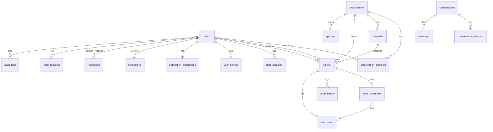

*This project has been created as part of the 42 curriculum by fcela-ga, <login2>, <login3>, <login4>.*

<!-- DRAFT prepared by DevOps (fcela-ga). Every block marked TODO(<role>) must be
     filled in by the person named before the defense; the infrastructure,
     instructions and operations sections describe the code as it is. -->

# HelpDesk Lite

**Live:** https://helpdesklite.me · **Staging:** https://staging.helpdesklite.me
(protected by a Cloudflare challenge; ask the team for access)

## Description

HelpDesk Lite is a multi-tenant help-desk (ticketing) web application. An
organization registers, invites its members and agents, and its users open
tickets that agents triage, assign, discuss and resolve, with the whole
history kept for audit. It is built as a monorepo (React front end, Express
API, shared validation contracts) and runs in production on a single
ARM server behind Cloudflare, with encrypted off-site backups and a full
monitoring and alerting stack.

Key features:

- Accounts with e-mail verification, password reset, sessions with rotating
  refresh tokens and reuse detection, progressive lockout after failed logins.
- Organizations with three roles (`MEMBER`, `AGENT`, `ORG_ADMIN`) plus a
  platform `GLOBAL_ADMIN`; per-organization categories and API keys.
- Tickets with priority, category, status workflow
  (`OPEN → IN_PROGRESS → RESOLVED → CLOSED`), assignment to agents, public
  and internal comments, attachments (type-checked, image-normalized) and an
  append-only history.
- Real-time updates and direct messages over Socket.IO; friendships; in-app
  and e-mail notifications with per-user preferences.
- Public REST API for integrations, authenticated with scoped API keys and
  rate-limited per key.
- GDPR: data export and account deletion requests; audit log of sensitive
  actions; legal pages (privacy policy, terms of service).
- User locale (English / Spanish), timezone and theme stored per account.
- Operations: CI with tests and security scans, staging and production
  pipelines with approval gate and automatic rollback, encrypted backups
  with weekly restore drills, Prometheus/Grafana/Loki observability and
  Telegram + e-mail alerting.

## Instructions

### Prerequisites

| Tool | Version | Notes |
|---|---|---|
| Node.js | 24 (`.nvmrc`) | npm ≥ 11 |
| Docker | ≥ 27 with Compose v2 | PostgreSQL 15, Redis 7 and Mailpit run in containers |
| GNU Make | any | convenience targets (`make up-dev`, `make down-dev`, …) |

### Run it locally (development)

```bash
git clone <repo-url> && cd <repo>
cp .env.example .env            # defaults work for local development
make up-dev                     # generates dev secrets, builds and starts db, redis, mailpit, api and web
npm install                     # workspaces: apps/api, apps/web, packages/contracts, packages/ui
npm run dev:api                 # http://localhost:5000  (API, hot reload)
npm run dev:web                 # http://localhost:5173  (Vite)
```

- Mailpit (captured e-mails): http://localhost:8025
- API reference: [`apps/api/ENDPOINTS.md`](apps/api/ENDPOINTS.md) (105 routes)
- Front/back integration notes: [`apps/web/INTEGRATION.md`](apps/web/INTEGRATION.md)
- Frontend conventions: [`apps/web/FRONTEND_GUIDE.md`](apps/web/FRONTEND_GUIDE.md)
- UI design system: [`packages/ui/README.md`](packages/ui/README.md)
- Quality gates, same as CI: `npm run lint`, `npm run typecheck`,
  `npm run format:check`, `npm test --workspaces --if-present`.

`.env` variables (names only; see `.env.example` for defaults): database
(`DATABASE_URL`, `POSTGRES_*`), `REDIS_URL`, `JWT_ACCESS_SECRET`,
`JWT_REFRESH_SECRET`, `PASSWORD_PEPPER`, token TTLs, `SMTP_*`/`MAIL_FROM`,
upload limits, rate limits, `CORS_ORIGINS`, `METRICS_TOKEN` (optional),
`BOOTSTRAP_ADMIN_EMAIL` (optional: the account with that e-mail becomes
`GLOBAL_ADMIN` on first start).

### Production

Production is not started by hand: merging into `develop` deploys staging,
merging into `main` (pull request approved by another person; the `gate`
job checks it) deploys production. The pipeline builds ARM64 images, pushes
them to GHCR tagged with the commit SHA, takes a pre-deploy backup, runs the
Prisma migrations, starts the stack and rolls back automatically if the API
does not become healthy. Everything an operator needs — diagnosis, manual
redeploy, restore, planned stops, alerts, the fallback plan when Cloudflare
is blocked — is in the team's DevOps guide and runbook, kept outside this
repository (ask the DevOps member).

```
Browser ─HTTPS─▶ Cloudflare (WAF, cache, TLS) ─▶ Oracle Cloud VM (ARM, Ubuntu)
                                                   ├─ Nginx Proxy Manager (:80/:443, only from Cloudflare ranges)
                                                   ├─ prod:    web (nginx) · api (Express) · db (PostgreSQL 15) · redis · mailpit · backup (cron)
                                                   ├─ staging: same stack, separate volumes and secrets
                                                   └─ observability: Prometheus · Alertmanager · Grafana · Loki/Promtail · exporters
Backups ─encrypted─▶ Oracle Object Storage        Alerts ─▶ Telegram + e-mail
```

## Resources

- Express 5 — https://expressjs.com/ · Prisma — https://www.prisma.io/docs ·
  Zod — https://zod.dev · Socket.IO — https://socket.io/docs/v4/
- React 19 — https://react.dev · Vite — https://vite.dev · Tailwind CSS 4 — https://tailwindcss.com
- PostgreSQL 15 — https://www.postgresql.org/docs/15/ · Redis — https://redis.io/docs/
- OWASP ASVS and Cheat Sheet Series (authentication, session management,
  file upload) — https://cheatsheetseries.owasp.org/
- Prometheus — https://prometheus.io/docs/ · Grafana — https://grafana.com/docs/ ·
  Loki — https://grafana.com/docs/loki/
- Docker Compose — https://docs.docker.com/compose/ · GitHub Actions — https://docs.github.com/actions
- Cloudflare (proxy, WAF, SSL modes) — https://developers.cloudflare.com/

### How AI was used

<!-- TODO(each member): add your own usage honestly; the subject requires it. -->

- **DevOps (fcela-ga):** Claude Code (Anthropic) was used as a pair for the
  infrastructure work: reviewing the two external audits against the real
  code and server, diagnosing alerts and incidents from logs and metrics,
  drafting the operations scripts (`scripts/ops/*`, `scripts/backup.sh`,
  `scripts/restore.sh`), the alert rules, the production gate and this
  runbook, and analysing the automated review comments on pull requests.
  Every script was executed and verified on the server by the author; the
  decisions (what to fix, what to leave out of scope, what to ask the team)
  were taken by the author and are recorded in the audit reports.
- **Backend:** TODO(backend).
- **Frontend:** TODO(frontend).

## Team Information

<!-- TODO(PM): confirm logins, roles and responsibilities. -->

| Member | Role(s) | Responsibilities |
|---|---|---|
| fcela-ga | DevOps / infrastructure | CI/CD, hosting, security hardening, backups and recovery, observability and alerting, operations documentation |
| <login2> | TODO | TODO |
| <login3> | TODO | TODO |
| <login4> | TODO | TODO |

## Project Management

<!-- TODO(PM): meetings cadence, task board, how tasks were split. -->

- Code: GitHub, feature branches (`backend`, `frontend`, `dev-ops`) merged
  into `develop` through pull requests reviewed by another member; `main`
  only receives `develop` and is what production runs. Pull request
  template with a merge checklist; CODEOWNERS for the infrastructure paths.
- Documentation: Notion workspace (endpoints, integration guides) and the
  Markdown files in this repository.
- Communication: TODO(PM) (e.g. Discord/WhatsApp, weekly sync).
- Task tracking: TODO(PM) (e.g. Trello/GitHub Projects).

## Technical Stack

| Layer | Choice | Why |
|---|---|---|
| Front end | React 19, TypeScript, Vite 8, Tailwind CSS 4, hand-rolled router (`app/routes.ts`), feature folders (`features/*`), shared `packages/ui` | Small explicit routing/state layer, semantic tokens and reusable typed UI components; typed end to end with shared contracts |
| API | Node 24, Express 5, TypeScript, Zod 4 (`packages/contracts`) | Small, explicit HTTP layer; every payload validated by the same schemas the front end uses |
| Data access | Prisma 7 with `@prisma/adapter-pg`, versioned migrations | Typed queries, migrations applied automatically on deploy |
| Database | PostgreSQL 15 | Relational data (organizations → members → tickets → comments) with strong constraints and cascades; mature backup tooling (`pg_dump`/`pg_restore`) |
| Cache / sessions | Redis 7 (`ioredis`) | Access-token revocation, refresh-token families, rate limiting, Socket.IO state |
| Real time | Socket.IO 4 | Tickets, chat and notifications pushed to the browser; handshake authenticated with the access token |
| Auth | Argon2id + pepper, JWT access (15 min) + HttpOnly rotating refresh cookie | Short-lived tokens, reuse detection, logout everywhere |
| Files | multer + file-type + sharp | Uploads verified by content, images re-encoded |
| Mail | nodemailer → Mailpit (captured) | No real e-mail leaves the demo environments |
| Web server | nginx (front end) + Nginx Proxy Manager | Static assets with cache and security headers; one entry point per environment |
| Infrastructure | Docker Compose, Oracle Cloud (ARM Ampere), Cloudflare | Free ARM instance; Cloudflare hides the origin and terminates TLS for visitors |
| CI/CD | GitHub Actions, GHCR, Trivy, gitleaks, Dependabot | Tests + scans on every PR; images built once and promoted by SHA |
| Observability | Prometheus, Alertmanager, Grafana, Loki + Promtail, node/cAdvisor/postgres/redis/blackbox exporters | 21 alert rules with runbooks; logs searchable without SSH |
| Backups | `backup.sh` (AES-256, `pg_dump` + uploads) → Oracle Object Storage; `restore.sh --drill` weekly | Measured RTO (seconds), verified integrity, tested restores |

## Continuous Integration and Delivery

Every change travels the same path, and nothing reaches an environment without
walking it: pull request → CI → `develop` → staging → `main` → production. The
images are built **once** per commit and promoted by SHA, so what runs in
production is bit-for-bit what passed the tests.

### Workflows

| Workflow | Runs on | What it does |
|---|---|---|
| `ci.yml` | every pull request (and callable from the others) | The seven jobs below. `ci-success` aggregates them into the single check that branch protection requires |
| `deploy-staging.yml` | push to `develop` | Builds both images and deploys to staging |
| `deploy-prod.yml` | push to `main` | Production gate first; then builds and deploys |
| `security-audit.yml` | Mondays 04:00 UTC | Trivy against the image **actually deployed** (it resolves the SHA of the last green production deploy), `npm audit`, monthly SBOM, and a quarterly manual checklist (collaborators, secret age, SSH keys, open ports, Cloudflare ranges at the origin, expired exceptions) |
| `backup-drill.yml` | Mondays 03:30 UTC | `restore.sh --drill` against the latest backup, with the recovery time measured |

### The seven CI jobs

| Job | What it checks |
|---|---|
| `quality` | Prettier, ESLint, TypeScript across every workspace, and a full build |
| `unit-tests` | 106 cases (`node --test`), including a test that walks the real routers and fails if any route is missing from the OpenAPI document |
| `integration-tests` | 58 cases against **real** PostgreSQL and Redis, with migrations applied |
| `compose-validation` | The three Compose files parse, and no external image is pinned to a moving tag |
| `docker-build` | Both production images build (pull requests only) |
| `security` | gitleaks over the branch's commits, `npm audit` (critical blocks), Trivy over the tree, SBOM |
| `ci-success` | Single required check; green only if all of the above are |

Images are built on a **native ARM64 runner** (`ubuntu-24.04-arm`), which is
what the Oracle Ampere server runs. They used to be cross-built with QEMU: fast
with a warm cache, but a change to `package-lock.json` invalidated the `npm ci`
layer and the emulated build could take half an hour or hang outright.

### The production gate

`deploy-prod.yml` does not trust branch settings for the one rule that matters,
because **environment reviewers do not actually pause a deployment in a private
repository without an Enterprise plan**. The rule lives in code instead
(`scripts/ci/prod-gate.mjs`), and it asks the GitHub API for four things before
anything is built:

1. the commit reached `main` through a **merged** pull request — a direct push
   never deploys;
2. it carries an approval from **somebody other than the author**;
3. that approval is on the **latest** commit of the pull request — a later push
   invalidates it;
4. there are no outstanding *changes requested*.

A manual release (*Run workflow*) is allowed only for logins listed in the
`PROD_APPROVERS` variable. `.github/CODEOWNERS` adds 27 infrastructure paths so
GitHub requests the right review automatically.

### What a deployment actually does

`scripts/deploy/remote-deploy.sh`, over SSH as the unprivileged `deployer`
user:

1. takes an **encrypted pre-deploy backup** and uploads it off the host; if that
   fails, the deployment stops before touching anything;
2. writes the environment's `.env` with mode `600`, and the documentation
   gate's password file, from the repository secrets — they never exist in the
   repository or inside an image;
3. **stops and removes the previous containers of that environment only**, so a
   stack started from another checkout cannot hold the names the new one needs;
4. starts the stack, waits for the health checks and runs a smoke test
   (`scripts/deploy/smoke.mjs`) that verifies the deployed commit is the one
   expected;
5. **rolls back to the previous SHA automatically** if any of that fails,
   dumping the API log first.

A `flock` lock shared with the self-healing timer keeps the two from acting on
the stack at the same time.

### Running the whole pipeline without GitHub Actions

Actions minutes can run out, and a full run should not be the only way to know
whether something works. The same steps run on any machine with Docker:

```bash
make ci                      # the six jobs, locally
make ci JOBS="quality unit"  # just some of them
make deploy-staging          # build and deploy, same tags and build args
make deploy-prod             # asks for written confirmation
```

Node and npm come from a container pinned to the versions in `.nvmrc` and
`devEngines`, so no local installation is needed and the result matches CI.
Two differences are deliberate: the local path does not run the production gate
(there is nobody to approve a pull request on your laptop, hence the written
confirmation), and the images stay on that host instead of GHCR.

### Secrets

No secret is ever in the repository. GitHub Actions injects them at deploy time;
the deployment writes them to the server with mode `600` and mounts them
read-only where a container needs them. `scripts/gen-secrets.sh` generates a
complete set for a new environment and `scripts/ci/rotate-secrets.sh` prints a
fresh one to paste into GitHub. The full inventory — which secret feeds what,
how to generate each one and what breaks if it is missing — is in the team's
DevOps guide.

### Why this is claimed as a Module of Choice (Major)

The subject asks for an explicit justification for any custom module
(chapter IV.10), so here it is.

**Why we chose it.** The project runs two environments on one small ARM server,
with four people merging into the same branch. The risk that actually
materialises in a team project is not a bug in a feature: it is a broken
deployment that nobody can undo, a secret committed by accident, or a change
that reaches production without anybody having read it. None of the listed
modules addresses that, and it is the problem we had.

**What technical challenges it addresses.** Four, each solved in code rather
than in settings:

1. *A deployment that cannot be rolled back.* Every deployment takes an
   encrypted backup first, verifies the stack afterwards with health checks and
   a smoke test that compares the running commit against the expected one, and
   returns to the previous image automatically if any of that fails.
2. *Reviews that do not actually block.* GitHub's environment reviewers do not
   pause anything in a private repository without an Enterprise plan, so the
   rule lives in `scripts/ci/prod-gate.mjs` and is enforced against the API:
   merged pull request, approval from somebody other than the author, on the
   latest commit, with no outstanding changes requested.
3. *Builds that do not match the target.* Images are built on a native ARM64
   runner, the same architecture as the server, once per commit and promoted by
   SHA — so what runs in production is what passed the tests, not a rebuild.
4. *A pipeline that only exists inside a provider.* The same six jobs and both
   deployments run on any machine with Docker (`make ci`, `make deploy-*`),
   with Node and npm pinned to the versions in `.nvmrc` and `devEngines`. The
   project does not stop when the Actions quota does.

**How it adds value.** It is the reason the other modules can be demonstrated
at all: staging and production are reachable, current and recoverable, and a
mistake costs minutes instead of an evening. It also caught real defects —
a deployment that failed silently for two weeks because an approver's login had
a capital I written as a lowercase L, and two environments whose containers
could take each other's names on a shared network.

**Why it deserves Major status.** It is not a configuration file. It is five
workflows, seven CI jobs, a gate written against the GitHub API, a deployment
script with backup, lock, health checks, smoke test and rollback, two scheduled
audits, a local runner that reproduces the whole pipeline, and a secret
lifecycle with generation and rotation. It is the single largest piece of work
in this repository outside the application itself, and removing it would not
degrade the product — it would make it undeployable.

## Observability and Alerting

The stack is deployed once per host (`compose.observability.yml`) and watches
both environments. Nothing it exposes is published to the internet: Grafana and
Prometheus listen on `127.0.0.1` and are reached through an SSH tunnel.

| Piece | Version | What it is for |
|---|---|---|
| Prometheus | 3.14 | Scrapes every target every 15 s, evaluates the alert rules |
| Alertmanager | 0.34 | Groups, silences and routes alerts to e-mail and Telegram |
| Grafana | 13.2 | Provisioned dashboard (`helpdesk-overview`), data sources as code |
| Loki + Promtail | 3.4 | Container logs, searchable without SSH, with secrets masked on the way in |
| Exporters | node 1.12, cAdvisor 0.55, postgres 0.17, redis 1.69, blackbox 0.26 | Host, containers, both databases, both caches, and HTTP probes against the two public sites |

Loki and Promtail are part of how the service is run, **not of a claimed
module**. The subject's log-management module names Elasticsearch, Logstash and
Kibana, and this deployment does not run them: on a free ARM instance that
already hosts two complete environments, Loki indexes labels instead of
document bodies and reuses the Grafana that Prometheus already needs, instead
of adding a second JVM-sized service and a second web front end to publish and
protect. That is an operational choice, so no point is claimed for it.

### What the application itself reports

The API publishes nine metrics of its own at `GET /api/metrics`, guarded by
`METRICS_TOKEN` so the endpoint answers 404 to anybody else:

`http_requests_total`, request duration, requests in flight, rate-limit
rejections, authentication failures, dependency up/down, dependency latency,
real-time connections and domain events. They are what makes the alerts about
latency, sustained 5xx and rate limiting possible — Prometheus alone could not
see any of that.

Three endpoints complete the picture: `GET /api/health` (liveness),
`GET /api/health/ready` (dependencies, degraded states included) and
`GET /api/health/status`, which reports functional areas — authentication,
tickets, attachments, real time — rather than infrastructure detail, so it can
be shown publicly. The status page at [`/status`](https://helpdesklite.me/status)
is the human-readable face of that last one; see below.

### The 21 alert rules

Grouped by what they protect (`config/prometheus/rules/`), every one of them
carrying a link to its runbook entry:

| Area | Rules |
|---|---|
| Availability | site down, API not ready, container restart loop, probe target down |
| Behaviour under load | sustained 5xx, high latency, rate limiting firing |
| Resources | low disk, critical disk, high memory, PostgreSQL near its connection limit, Redis out of memory |
| Backups | backup failed, backup too old, no backup metric at all, backup suspiciously small |
| Restore drills | drill too old, no drill metric, drill failed |
| TLS | certificate expiring soon, certificate expiring now |

The three "no metric at all" rules exist because a backup job that never runs
produces no failures either: silence is the failure mode that looks like
success. Alerts were provoked deliberately and the delivery verified by e-mail
and Telegram, which is the part that cannot be shown from the configuration
files.

### Health checks, the status page and recovery

Three probes, each with one job and one audience:

| Probe | Who reads it | What it answers |
|---|---|---|
| `GET /api/health` | Docker and the deploy script | Is the process alive? Answers from memory and is never rate limited, because the container healthcheck polls it |
| `GET /api/health/ready` | the deploy smoke test, Prometheus | Are PostgreSQL, Redis, storage and SMTP reachable, and which of them is degraded? |
| `GET /api/health/status` | the status page, uptime checkers | Can people sign in, open tickets, attach files, chat, receive e-mail? |

The last one answers twice. Without credentials it returns a traffic light per
**functional area** — never a component name, a latency, a version or an error
message, because those add up to a map of the infrastructure. With the
operation token (`Authorization: Bearer $METRICS_TOKEN`) it returns the full
view: every dependency, its latency, the deployed version and commit. The smoke
test asserts the anonymous answer stays free of `services`, `version`, `commit`
and `uptimeSeconds`, so the day someone widens the public payload the deploy
fails instead of leaking.

The SMTP probe runs on a 60-second timer rather than inside the request: a
`verifyMail()` against a host that does not resolve takes about five seconds,
and at 300 requests per minute that turned an anonymous endpoint into a cheap
amplifier.

**The status page** is at `/status`. It is a static file
(`apps/web/public/status.html` plus `status.js`), deliberately not a route of
the single-page application:

- it does not need the React bundle, so a broken build still leaves a page up;
- it does not need the API, so when the application is down — which is exactly
  when somebody opens it — the page loads and says so in red instead of not
  loading at all;
- it needs no session and touches no database.

It refreshes every 60 seconds, the same window the API caches the public
answer for, and again whenever the tab regains focus. Status is never conveyed
by colour alone: each row carries its own wording and symbol.

The honest limit, because it will come up in the defence: if this nginx goes
down the page goes with it, and the blackbox exporter catches that — it probes
both public sites every 15 s and `site down` fires within two minutes. But the
blackbox exporter runs on the same host it watches, so a **full machine**
outage takes the alerting down with it and nothing fires. That is the
single-server trade-off listed under Known limitations; today it is covered by
the runbook, not by a second machine.

**Backups and disaster recovery** close the module. `backup.sh` dumps
PostgreSQL and the uploads nightly, encrypts them with AES-256 and ships them
to Oracle Object Storage; `restore.sh` restores with integrity checks, and
`restore.sh --drill` runs every Monday from `backup-drill.yml`, restoring the
latest backup into a throwaway database and recording the recovery time. Both
publish metrics, and seven of the 21 alert rules watch them — including the
three that fire on the *absence* of a metric, because a backup job that never
runs reports no failures either.

To check the whole thing in one go:

```bash
curl -s https://helpdesklite.me/api/health/status | jq        # public traffic light
curl -s -H "Authorization: Bearer $METRICS_TOKEN" \
     https://helpdesklite.me/api/health/status | jq           # operator view
curl -sI https://helpdesklite.me/status | head -1             # the page itself
```

## Database Schema

PostgreSQL schema managed by Prisma (`apps/api/prisma/schema.prisma`, 20
tables). Main entities and relationships:


```mermaid
erDiagram
    users ||--o{ organization_members : "belongs to"
    organizations ||--o{ organization_members : has
    organizations ||--o{ categories : has
    organizations ||--o{ tickets : owns
    organizations ||--o{ api_keys : issues
    users ||--o{ tickets : creates
    users o|--o{ tickets : "assigned to"
    categories o|--o{ tickets : classifies
    tickets ||--o{ ticket_comments : has
    tickets ||--o{ ticket_history : logs
    tickets ||--o{ attachments : has
    ticket_comments ||--o{ attachments : has
    users ||--o{ user_sessions : has
    users ||--|| user_profiles : has
    users ||--|| notification_preferences : has
    users ||--o{ notifications : receives
    users ||--o{ friendships : "requests / receives"
    conversations ||--o{ conversation_members : has
    conversations ||--o{ messages : has
    users ||--o{ gdpr_requests : files
    users o|--o{ audit_logs : acts
```

Key fields:

- `users`: `id` (UUID v7), `email` (unique), `username` (unique), `passwordHash`
  (Argon2id), `globalRole` (`USER` | `GLOBAL_ADMIN`), `isActive`,
  `failedLoginCount`, `locale`, `timezone`, `theme`.
- `organizations`: `id`, `name`, `slug` (unique), `ticketSeq` (per-org ticket
  numbering), `createdById`.
- `organization_members`: (`organizationId`, `userId`) unique, `role`
  (`MEMBER` | `AGENT` | `ORG_ADMIN`), `invitedById`.
- `tickets`: `id`, `reference` (e.g. `VILANO-0001`: six letters of the org slug + sequence), `title`, `description`,
  `status` (`OPEN` | `IN_PROGRESS` | `RESOLVED` | `CLOSED`), `priority`
  (`LOW` | `MEDIUM` | `HIGH`), `categoryId`, `createdById`, `assignedToId`,
  `resolvedAt`, `closedAt`.
- `ticket_comments`: `body`, `isInternal` (agents only), soft delete;
  `ticket_history`: `field`, `oldValue`, `newValue`, `note` (append-only).
- `attachments`: `originalName`, `storageKey`, `mimeType`, `sizeBytes`,
  `status`, linked to a ticket or a comment.
- `user_sessions`: `familyId`, `refreshTokenHash`, `replacedById`
  (rotation chain, reuse detection), `userAgent`, `ip`.
- `api_keys`: `prefix`, `keyHash`, `scopes`, `rateLimitPerMinute`,
  `lastUsedAt`; `audit_logs`: `actorId` / `apiKeyId`, `action`, `entity`,
  `entityId`, `before`/`after`, `ip`.

Deleting a user or an organization cascades to its dependent rows
(sessions, memberships, categories, tickets, comments, attachments);
assignee and category references are set to `NULL`.

## Privacy and data rights

The four things the GDPR module asks for, all of them reachable from
**Account → Privacy & data** and none of them a mock-up.

| Right | How it works |
|---|---|
| Request your data | `POST /gdpr/export` creates the request and e-mails a code valid for 30 minutes. Nothing is built until it is confirmed |
| Readable export | After confirmation the archive is assembled in the background — profile, tickets, comments, messages, notifications, attachments, memberships, friendships and sessions — and served as a ZIP of JSON from an authenticated, short-lived URL |
| Deletion with confirmation | `POST /gdpr/delete` needs **two** factors to go through: the code from the e-mail and your own username typed back. An irreversible action deserves the friction |
| Confirmation e-mails | Sent when a request is opened and again when the archive is ready |

Deletion is a real erasure, not a flag: the account, its sessions,
notifications and private messages go. What other people depend on — a comment
on somebody else's ticket — is anonymised instead, which is what the regulation
allows and what keeps their records readable.

Two things matter for anyone reproducing this:

- **The links in those e-mails** carry the confirmation code into the
  application (`#account/export-requested?token=…`). The field stays editable,
  because a mail client that breaks a long line should not be the end of the
  road.
- **Where the e-mail goes** depends on one variable. Without `SMTP_USER` the
  mail is delivered to the Mailpit instance that ships with the environment:
  real messages, kept on the server, visible through the SSH tunnel, never
  leaving the machine. With `SMTP_USER` set, the transport authenticates
  against a real relay and refuses to send without TLS, so confirmations —
  along with e-mail verification and password recovery — reach an actual
  inbox. The credentials come from `<ENV>_SMTP_USER` and `<ENV>_SMTP_PASS`;
  if they are missing the deployment still succeeds and stays on Mailpit.

## Public API

A second entry point into the same data, meant for integrations rather than for
the browser, and demonstrable entirely with `curl`.

### Access control

| | |
|---|---|
| Authentication | `X-API-Key`. The key is a public prefix plus a secret, and the secret is **hashed with Argon2id** and shown once, at creation |
| Authorisation | Scopes per key: `tickets:read/write`, `comments:read/write`, `categories:read/write` |
| Tenancy | Every key belongs to one organization and can never see another's data |
| Rate limiting | 60 requests/minute and 1000/hour per key, on top of the global per-IP limits |
| Audit | Key creation and revocation are recorded in `audit_logs` with the actor |

Fourteen endpoints cover the full cycle — list, read, create, update and delete
tickets, comments and categories — with pagination and filtering.

### Documentation

`GET /api/v1/openapi.json` serves an OpenAPI 3.0.3 document covering the
**105 operations** of the whole API in 18 sections, and `GET /api/v1/docs`
renders it as a browsable reference with *Try it out*. Both authentication
schemes work from that page: bearer token for a session, `X-API-Key` for this
API.

Two decisions are worth stating, because they are what keeps the document
honest:

- **Request bodies are not written by hand.** They are the same Zod contracts
  (`packages/contracts`) that the API validates with, converted at build time.
  The documentation cannot drift from what the server enforces, because it *is*
  what the server enforces.
- **A test fails if the two disagree.** `apps/api/test/unit/openapi.test.ts`
  walks the real routers and fails if a route is undocumented, if a documented
  route does not exist, or if an operation is missing its id, tag, summary,
  description, security or responses.

`apps/api/ENDPOINTS.md` stays as the quick reference table and ends with a
ten-step demonstration script, run end to end against a real database.

### How the reference is protected

The reference describes every route, payload and rule of the API, which is more
useful to somebody probing the service than to anybody else. In development it
is open; in staging and production it sits behind two independent doors:

1. nginx asks for a team credential (HTTP Basic). The password file is written
   by the deployment from a secret, with mode `600`, and mounted read-only — it
   is in neither the repository nor any image.
2. The API then requires proof that the request came through that nginx, or a
   `GLOBAL_ADMIN` session for anybody hitting the API directly.

A refusal is always a **404**, never a 401 or 403: a locked door tells an
attacker there is something worth forcing. If the secret is missing the
deployment closes the reference instead of leaving it open, and
`DOCS_ACCESS=public` is refused in production.

## Features List

<!-- TODO(each member): one line per feature you built; keep it honest. -->

| Feature | Who | Description |
|---|---|---|
| Authentication & sessions | TODO(backend) | Register, e-mail verification, login with lockout, refresh rotation, logout everywhere |
| Organizations, roles, categories, API keys | TODO(backend) | Multi-tenant model with RBAC policies |
| Tickets, comments, attachments, history | TODO(backend) | Workflow, assignment, internal notes, upload validation |
| Real-time & chat | TODO(backend) | Socket.IO rooms per ticket/user, direct messages, presence |
| Notifications & e-mail | TODO(backend) | In-app + SMTP, user preferences |
| Public API | TODO(backend) | Scoped API keys, per-key rate limits |
| GDPR export/delete, audit log | TODO(backend) · fcela-ga (screens, e-mail links and transport) | Export and deletion requests with an e-mailed code, a second factor on deletion, a background ZIP build and anonymisation of what other people depend on; the audit log records who did what |
| Front end (all screens) | TODO(frontend) | Sign in / register, workspace, organizations, ticket list / detail / create, people and profiles, messages, account and privacy, global admin, legal pages |
| CI/CD pipelines | fcela-ga | Reusable CI (lint, types, tests, Trivy, gitleaks), staging/production deploys with approval gate and rollback |
| Hosting & security hardening | fcela-ga | Oracle VM, Cloudflare, origin closed to Cloudflare ranges (VCN + iptables), fail2ban, least-privilege DB roles, security headers, rate limits |
| Health checks & status page | fcela-ga | Liveness and readiness probes, a per-area public traffic light that hides infrastructure detail, and a status page at `/status` served as a static file so it stays up when the application does not |
| Backups & recovery | fcela-ga | Encrypted daily backups off-site, weekly restore drills with measured RTO, production restore with integrity checks |
| Observability & alerting | fcela-ga | Prometheus/Grafana/Loki, 21 alert rules, Telegram + e-mail, self-healing timer |
| Operations documentation | fcela-ga | DevOps guide, runbook, audit reports and secrets inventory (kept outside the repository) |

## Modules

<!-- TODO(PM): list the chosen Major/Minor modules with points, justification,
     implementation notes and owner. Suggested infrastructure-related entries: -->

| Module | Type | Points | Owner | Implementation |
|---|---|---|---|---|
| TODO | Major | 2 | TODO | TODO |
| Custom-made design system with reusable components | Minor | 1 | arielrhea | 15 generic reusable components in `packages/ui` — the module asks for ten — built on semantic tokens rather than raw values: a `@theme` palette (canvas, surface, border, ink, muted, primary and the four feedback colours), one type scale, shared radii and a typed `Icon` set. `packages/ui/README.md` is the catalogue: every component with its API, its variants, what it is used for, and the keyboard and accessibility behaviour it guarantees. `BrandMark` is exported too but deliberately not counted, because it is product branding and not a generic component |
| Public API with authentication, rate limiting and documentation | Major | 2 | fcela-ga | 14 endpoints with `X-API-Key` (Argon2id secret shown once), per-key scopes, 60/min and 1000/h limits and organization tenancy; OpenAPI 3.0.3 with 105 operations generated from the Zod contracts, browsable at `/api/v1/docs` behind two independent doors, and a test that fails if any route is undocumented. See «Public API» above |
| CI/CD pipeline with automated testing and deployment | Major | 2 | fcela-ga | Seven CI jobs on every pull request, images built once per SHA on a native ARM64 runner and promoted by SHA, a production gate enforced in code (`scripts/ci/prod-gate.mjs`) because environment reviewers do not pause anything in a private repository, encrypted pre-deploy backup, smoke test and automatic rollback, and the whole pipeline reproducible locally with `make ci` / `make deploy-*`. See «Continuous Integration and Delivery» above |
| Monitoring system with Prometheus and Grafana | Major | 2 | fcela-ga | `compose.observability.yml`: Prometheus 3.14, Grafana 13.2, Alertmanager, five exporters and blackbox probes; nine application metrics behind `METRICS_TOKEN`; 21 alert rules with runbooks, delivery verified by e-mail and Telegram. See «Observability and Alerting» above |
| Health check and status page system with automated backups and disaster recovery | Minor | 1 | fcela-ga | Liveness, readiness and a public per-area traffic light (`/api/health`, `/ready`, `/status`), the last one answering with full detail only to the operation token; a status page at `/status` served as a static file so it survives both the application bundle and the API; nightly AES-256 backups to Oracle Object Storage, `restore.sh` with integrity checks and a weekly automated restore drill with the recovery time measured; seven alert rules watch backups and drills, three of them on the absence of the metric. See «Health checks, the status page and recovery» above |
| GDPR compliance features | Minor | 1 | fcela-ga | The module's four subpoints, end to end from the browser: request your data (`POST /gdpr/export`), deletion with confirmation (`POST /gdpr/delete`, needing both the e-mailed code **and** your own username typed back), export in a readable format (a ZIP of JSON built in the background and served through a short-lived authenticated download) and confirmation e-mails at every step. Content other people depend on is anonymised rather than erased, which is what the regulation allows. See «Privacy and data rights» below |
| TODO | … | … | … | … |
| **Total** | | **TODO** | | |

## Individual Contributions

<!-- TODO(each member): what you built, challenges and how you solved them. -->

### fcela-ga — DevOps

- Designed and ran the delivery pipeline: reusable CI, SHA-tagged ARM64
  images on GHCR, staging on `develop`, production on `main` behind an
  approval gate (`scripts/ci/prod-gate.mjs`), pre-deploy backup and
  automatic rollback (`scripts/deploy/remote-deploy.sh`).
- Hosted the platform on Oracle Cloud behind Cloudflare; closed the origin
  to Cloudflare's ranges at two layers (VCN security list and
  `DOCKER-USER`), hardened SSH, added fail2ban, least-privilege database
  roles, nginx security headers and rate limits.
- Built the backup system (encrypted, verified, off-site, 14-day retention)
  and the restore tooling with weekly drills; measured RTO of a few seconds.
- Built the health-check and status system: three probes with separate
  audiences, a public traffic light by functional area that deliberately
  hides component names, latencies and versions, and a status page served
  as a static file so that neither a broken bundle nor a dead API can take
  it down with them. The deploy smoke test fails if the anonymous answer
  ever starts leaking internal detail.
- Built the observability stack and alerting (Telegram + e-mail), with
  runbook annotations on every alert; added a self-healing timer after a
  15-hour outage caused by a deliberate stop that was never reverted.
- Wrote the operations runbook, the secrets inventory and three audit
  reports reconciling external reviews with the real state of the system.
- Challenges: two repositories deploying to the same host during the
  hand-over, an Alertmanager that started with an empty config because a
  template path was a directory, a court-ordered block of Cloudflare IPs in
  Spain (fallback plan documented), and keeping every secret out of the
  repository and the chat while automating everything.

### <login2> — TODO
### <login3> — TODO
### <login4> — TODO

## Known limitations

- E-mail is captured by Mailpit unless `SMTP_USER` is configured, in which
  case the transport authenticates against a real relay over TLS and messages
  reach actual inboxes. The demo environments are deliberately left on Mailpit:
  a student project should not be sending mail to strangers.
- Single-server deployment: no high availability, and the monitoring runs on
  the same machine it watches, so a full host outage is not self-alerting.
  Recovery relies on the backups and the runbook.
- Cloudflare IP ranges can be blocked from some Spanish networks during
  football matches (court order); see the fallback plan in the runbook.

## License

TODO(PM) — e.g. MIT, or "educational use only".
